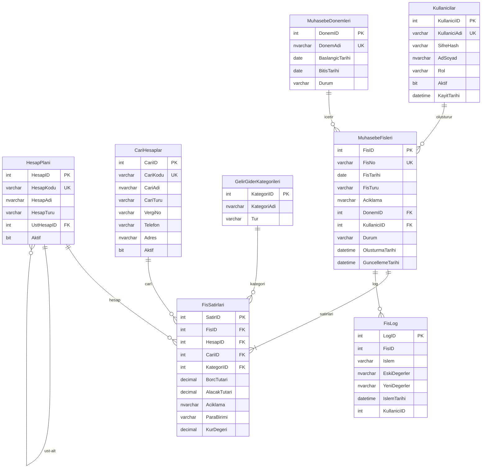

# Muhasebe Fiş, Gelir-Gider ve Defter Sistemi — Veritabanı Projesi (Selami Kalay)

> **Hazırlayan:** Selami Kalay  
> **Tarih:** 15 Mart 2026  
> **RDBMS Hedefi:** SQL Server (T-SQL)

---

## 1. Problem Tanımı

### 1.1 Sistemin Amacı

Bu veritabanı sistemi, küçük ve orta ölçekli işletmelerin **muhasebe fişlerini**, **gelir-gider hareketlerini** ve **defterlerini** dijital ortamda güvenli, tutarlı ve izlenebilir biçimde yönetmesini sağlamak amacıyla tasarlanmıştır.

### 1.2 Çözülen Problemler

| # | Problem | Çözüm |
|---|---------|-------|
| 1 | Kâğıt tabanlı fiş takibinin hataya açık olması | Dijital fiş kaydı ve otomatik numaralandırma |
| 2 | Gelir-gider dengesinin anlık takip edilememesi | Canlı bakiye hesaplama fonksiyonları |
| 3 | Denetim izinin (audit trail) bulunmaması | Log/tarihçe tablosu ve trigger mekanizması |
| 4 | Çift taraflı kayıt (double-entry) tutarlılığının bozulması | CHECK kısıtları ve SP içinde TRANSACTION kontrolü |
| 5 | Raporlama güçlüğü | View ve analitik sorgular |

### 1.3 Temel İş Kuralları (Business Rules)

1. **Çift Taraflı Kayıt (Double-Entry):** Her muhasebe fişinde toplam **Borç** tutarı, toplam **Alacak** tutarına eşit olmalıdır.
2. **Fiş Numaralandırma:** Her fiş benzersiz bir `FisNo` değerine sahiptir ve sistem tarafından otomatik üretilir.
3. **Hesap Planı Hiyerarşisi:** Hesaplar ana hesap → alt hesap şeklinde ağaç yapısında organize edilir (self-referencing).
4. **Cari Hesap İlişkisi:** Her gelir-gider hareketi bir cari hesaba (müşteri, tedarikçi, personel vb.) bağlanabilir.
5. **Dönem (Periyot) Kontrolü:** Fişler bir muhasebe dönemine ait olmalıdır; kapatılmış döneme fiş girilemez.
6. **Silme Yasağı — Yumuşak Silme:** Fişler fiziksel olarak silinmez; `Durum` alanı ile pasif yapılır. Tüm değişiklikler log tablosuna yazılır.
7. **Para Birimi:** Sistem çoklu para birimini destekler; her fiş satırında kur bilgisi tutulur.
8. **Yetkilendirme:** Kullanıcılar rol bazlı yetkilere sahiptir (Muhasebeci, Yönetici, Salt Okunur).

---

## 2. ER Diyagramı

### 2.1 Varlıklar, Nitelikler ve İlişkiler

#### Varlıklar (Entities)

| Varlık | Açıklama | Temel Nitelikler |
|--------|----------|------------------|
| **Kullanicilar** | Sistemi kullanan personel | KullaniciID (PK), KullaniciAdi, Sifre, AdSoyad, Rol |
| **MuhasebeDonemleri** | Yıllık/aylık muhasebe dönemleri | DonemID (PK), DonemAdi, BaslangicTarihi, BitisTarihi, Durum |
| **HesapPlani** | Muhasebe hesap ağacı | HesapID (PK), HesapKodu, HesapAdi, HesapTuru, UstHesapID (FK→self) |
| **CariHesaplar** | Müşteri, tedarikçi, personel | CariID (PK), CariKodu, CariAdi, CariTuru, VergiNo, Telefon, Adres |
| **GelirGiderKategorileri** | Gelir/gider sınıflandırma | KategoriID (PK), KategoriAdi, Tur (Gelir/Gider) |
| **MuhasebeFisleri** | Fiş başlık bilgileri | FisID (PK), FisNo, FisTarihi, FisTuru, Aciklama, DonemID (FK), KullaniciID (FK), Durum |
| **FisSatirlari** | Fişe ait borç-alacak kalemleri | SatirID (PK), FisID (FK), HesapID (FK), CariID (FK), KategoriID (FK), BorcTutari, AlacakTutari, Aciklama, ParaBirimi, KurDegeri |
| **FisLog** | Fiş değişiklik tarihçesi | LogID (PK), FisID, Islem, EskiDegerler, YeniDegerler, IslemTarihi, KullaniciID |

#### İlişkiler (Relationships)

| İlişki | Tür | Açıklama |
|--------|-----|----------|
| Kullanicilar → MuhasebeFisleri | 1:N | Bir kullanıcı birden çok fiş oluşturur |
| MuhasebeDonemleri → MuhasebeFisleri | 1:N | Bir dönemde birden çok fiş bulunur |
| MuhasebeFisleri → FisSatirlari | 1:N | Bir fişte birden çok satır bulunur |
| HesapPlani → FisSatirlari | 1:N | Bir hesap birden çok fiş satırında geçer |
| CariHesaplar → FisSatirlari | 1:N | Bir cari birden çok fiş satırında geçer |
| GelirGiderKategorileri → FisSatirlari | 1:N | Bir kategori birden çok satırda kullanılır |
| HesapPlani → HesapPlani | Self 1:N | Ana hesap → alt hesap hiyerarşisi |
| MuhasebeFisleri → FisLog | 1:N | Bir fişe ait birden çok log kaydı olabilir |

### 2.2 ER Diyagramı (Görsel)


### 2.3 Mermaid.js ER Diyagramı



---

## 3. İlişkisel Şema, Anahtarlar ve Kısıtlar

### Tablolar ve Kısıtlamaların Özet Tablosu

| Tablo | PK | FK | UNIQUE | NOT NULL | CHECK |
|-------|----|----|--------|----------|-------|
| Kullanicilar | KullaniciID | — | KullaniciAdi | KullaniciAdi, SifreHash, AdSoyad, Rol | Rol IN ('Muhasebeci','Yonetici','SaltOkunur') |
| MuhasebeDonemleri | DonemID | — | DonemAdi | DonemAdi, BaslangicTarihi, BitisTarihi, Durum | Durum IN ('Acik','Kapali'); BitisTarihi > BaslangicTarihi |
| HesapPlani | HesapID | UstHesapID→HesapPlani | HesapKodu | HesapKodu, HesapAdi, HesapTuru | HesapTuru IN ('Aktif','Pasif','Gelir','Gider','Ozkaynaklar') |
| CariHesaplar | CariID | — | CariKodu | CariKodu, CariAdi, CariTuru | CariTuru IN ('Musteri','Tedarikci','Personel','Diger') |
| GelirGiderKategorileri | KategoriID | — | KategoriAdi+Tur | KategoriAdi, Tur | Tur IN ('Gelir','Gider') |
| MuhasebeFisleri | FisID | DonemID, KullaniciID | FisNo | FisNo, FisTarihi, FisTuru, DonemID, KullaniciID, Durum | FisTuru IN ('Mahsup','Tahsil','Tediye','Acilis','Kapanis'); Durum IN ('Aktif','Pasif','Iptal') |
| FisSatirlari | SatirID | FisID, HesapID, CariID, KategoriID | — | FisID, HesapID, BorcTutari, AlacakTutari | BorcTutari >= 0; AlacakTutari >= 0; NOT (BorcTutari > 0 AND AlacakTutari > 0) |
| FisLog | LogID | — | — | FisID, Islem, IslemTarihi | Islem IN ('INSERT','UPDATE','DELETE') |

---

## 4. Normalizasyon (En Az 3NF)

### 4.1 Birinci Normal Form (1NF)

> **Kural:** Her sütun atomik (bölünemez) değer içermelidir; tekrarlayan gruplar olmamalıdır.

**Kanıt:**

- `CariHesaplar` tablosunda Telefon, Adres gibi alanlar ayrı sütunlardadır; tek bir hücrede birden fazla telefon numarası tutulmaz.
- `FisSatirlari` ayrı bir tablodur; fiş başlık bilgisi ile satırlar tek bir tabloda tekrarlayan grup (repeating group) oluşturmaz.
- Tüm sütunlar tekil, atomik değer taşır.

### 4.2 İkinci Normal Form (2NF)

> **Kural:** 1NF + Tüm anahtar-olmayan sütunlar, birincil anahtarın **tamamına** bağımlı olmalıdır (kısmi bağımlılık yok).

**Kanıt:**

- `FisSatirlari` tablosunda PK = `SatirID` (tek sütun, surrogate key). `BorcTutari`, `AlacakTutari`, `Aciklama` gibi sütunlar yalnızca `SatirID`'ye bağımlıdır; kısmi bağımlılık mümkün değildir.
- Tüm tablolarda tek sütunlu surrogate primary key kullanıldığı için 2NF ihlali yapısal olarak imkânsızdır.

### 4.3 Üçüncü Normal Form (3NF)

> **Kural:** 2NF + Anahtar-olmayan sütunlar arasında geçişken (transitive) bağımlılık olmamalıdır.

**Kanıt — Potansiyel İhlal ve Çözüm:**

| Senaryo | İhlal Riski | Çözüm |
|---------|-------------|-------|
| Fiş satırında `CariAdi` tutmak | `SatirID → CariID → CariAdi` geçişken bağımlılık | `CariAdi` fiş satırında tutulmaz; `CariHesaplar` tablosundan JOIN ile çekilir |
| Fiş satırında `HesapAdi` tutmak | `SatirID → HesapID → HesapAdi` geçişken bağımlılık | `HesapAdi` fiş satırında tutulmaz; `HesapPlani` tablosundan JOIN ile çekilir |
| Fiş başlığında `DonemAdi` tutmak | `FisID → DonemID → DonemAdi` geçişken bağımlılık | `DonemAdi` fiş tablosunda tutulmaz; `MuhasebeDonemleri` tablosundan JOIN ile çekilir |

Tüm tablolar **3NF** gereksinimini karşılamaktadır.

---

## 5. DDL ve DML Scriptleri

> **Not:** Tam çalışır DDL ve DML scriptleri ayrı dosyalarda sağlanmıştır:
> - [01_DDL_Create_Tables.sql](file:///c:/Users/selam/Desktop/muhasebe%20veri%20tabanı%20projesi/01_DDL_Create_Tables.sql)
> - [02_DML_Insert_Data.sql](file:///c:/Users/selam/Desktop/muhasebe%20veri%20tabanı%20projesi/02_DML_Insert_Data.sql)

Aşağıda özet yapılar verilmiştir. Detaylı scriptler için yukarıdaki dosyalara bakınız.

### 5.1 DDL Özet

```sql
-- Tablo oluşturma sırası (FK bağımlılıklarına göre):
-- 1. Kullanicilar
-- 2. MuhasebeDonemleri
-- 3. HesapPlani
-- 4. CariHesaplar
-- 5. GelirGiderKategorileri
-- 6. MuhasebeFisleri
-- 7. FisSatirlari
-- 8. FisLog
```

### 5.2 DML Özet

Örnek veri seti şunları içerir:
- 3 kullanıcı (Yonetici, Muhasebeci, SaltOkunur)
- 2 muhasebe dönemi (2025, 2026)
- 12 hesap planı kaydı (ana ve alt hesaplar)
- 5 cari hesap
- 6 gelir-gider kategorisi
- 4 muhasebe fişi ve onlara bağlı satırlar

---

## 6. SQL Sorguları

> **Not:** Tüm sorgular ayrı dosyalarda sağlanmıştır:
> - [03_Temel_Sorgular.sql](file:///c:/Users/selam/Desktop/muhasebe%20veri%20tabanı%20projesi/03_Temel_Sorgular.sql)
> - [04_Ileri_Duzey_Sorgular.sql](file:///c:/Users/selam/Desktop/muhasebe%20veri%20tabanı%20projesi/04_Ileri_Duzey_Sorgular.sql)

### 6.1 Temel Sorgular (3 Adet)

1. **Belirli tarih aralığındaki fişleri getirme**
```sql
SELECT f.FisID, f.FisNo, f.FisTarihi, f.FisTuru, f.Aciklama, f.Durum, k.AdSoyad AS OlusturanKullanici, d.DonemAdi
FROM MuhasebeFisleri f
    INNER JOIN Kullanicilar k ON f.KullaniciID = k.KullaniciID
    INNER JOIN MuhasebeDonemleri d ON f.DonemID = d.DonemID
WHERE f.FisTarihi BETWEEN '2026-01-01' AND '2026-01-31' AND f.Durum = 'Aktif'
ORDER BY f.FisTarihi ASC, f.FisNo ASC;
```

2. **Bir cariye ait gelir-gider hareketlerini listeleme**
```sql
SELECT c.CariKodu, c.CariAdi, f.FisNo, f.FisTarihi, hp.HesapKodu, hp.HesapAdi, fs.BorcTutari, fs.AlacakTutari, fs.Aciklama AS SatirAciklama, kat.KategoriAdi, kat.Tur AS KategoriTuru
FROM FisSatirlari fs
    INNER JOIN MuhasebeFisleri f ON fs.FisID = f.FisID
    INNER JOIN CariHesaplar c ON fs.CariID = c.CariID
    INNER JOIN HesapPlani hp ON fs.HesapID = hp.HesapID
    LEFT JOIN GelirGiderKategorileri kat ON fs.KategoriID = kat.KategoriID
WHERE c.CariKodu = 'C001' AND f.Durum = 'Aktif'
ORDER BY f.FisTarihi ASC;
```

3. **Aktif hesap planını hiyerarşik listeleme**
```sql
SELECT hp.HesapID, hp.HesapKodu, hp.HesapAdi, hp.HesapTuru, ust.HesapKodu AS UstHesapKodu, ust.HesapAdi AS UstHesapAdi, CASE WHEN hp.UstHesapID IS NULL THEN N'Ana Hesap' ELSE N'Alt Hesap' END AS HesapSeviyesi
FROM HesapPlani hp
    LEFT JOIN HesapPlani ust ON hp.UstHesapID = ust.HesapID
WHERE hp.Aktif = 1
ORDER BY hp.HesapKodu ASC;
```

### 6.2 İleri Düzey Sorgular (3 Adet)

1. **Aylık bazda kâr/zarar durumu** (JOIN + GROUP BY + SUM)
```sql
SELECT YEAR(f.FisTarihi) AS Yil, MONTH(f.FisTarihi) AS Ay, FORMAT(f.FisTarihi, 'yyyy-MM') AS Donem,
    SUM(CASE WHEN hp.HesapTuru = 'Gelir' THEN fs.AlacakTutari * fs.KurDegeri ELSE 0 END) AS ToplamGelir,
    SUM(CASE WHEN hp.HesapTuru = 'Gider' THEN fs.BorcTutari * fs.KurDegeri ELSE 0 END) AS ToplamGider,
    SUM(CASE WHEN hp.HesapTuru = 'Gelir' THEN fs.AlacakTutari * fs.KurDegeri ELSE 0 END) - SUM(CASE WHEN hp.HesapTuru = 'Gider' THEN fs.BorcTutari * fs.KurDegeri ELSE 0 END) AS NetKarZarar
FROM FisSatirlari fs
    INNER JOIN MuhasebeFisleri f ON fs.FisID = f.FisID
    INNER JOIN HesapPlani hp ON fs.HesapID = hp.HesapID
WHERE f.Durum = 'Aktif' AND hp.HesapTuru IN ('Gelir', 'Gider')
GROUP BY YEAR(f.FisTarihi), MONTH(f.FisTarihi), FORMAT(f.FisTarihi, 'yyyy-MM')
ORDER BY Yil, Ay;
```

2. **En çok gider yapılan kategoriler** (GROUP BY + HAVING + Subquery)
```sql
SELECT kat.KategoriID, kat.KategoriAdi, COUNT(DISTINCT f.FisID) AS FisAdedi, COUNT(fs.SatirID) AS SatirAdedi, SUM(fs.BorcTutari * fs.KurDegeri) AS ToplamGider, AVG(fs.BorcTutari * fs.KurDegeri) AS OrtalamaGider
FROM FisSatirlari fs
    INNER JOIN MuhasebeFisleri f ON fs.FisID = f.FisID
    INNER JOIN GelirGiderKategorileri kat ON fs.KategoriID = kat.KategoriID
    INNER JOIN HesapPlani hp ON fs.HesapID = hp.HesapID
WHERE kat.Tur = 'Gider' AND f.Durum = 'Aktif' AND fs.BorcTutari > 0
GROUP BY kat.KategoriID, kat.KategoriAdi
HAVING SUM(fs.BorcTutari * fs.KurDegeri) > 5000 AND SUM(fs.BorcTutari * fs.KurDegeri) > (
    SELECT AVG(ToplamKategoriGider) FROM (
        SELECT SUM(fs2.BorcTutari * fs2.KurDegeri) AS ToplamKategoriGider FROM FisSatirlari fs2 INNER JOIN MuhasebeFisleri f2 ON fs2.FisID = f2.FisID INNER JOIN GelirGiderKategorileri kat2 ON fs2.KategoriID = kat2.KategoriID WHERE kat2.Tur = 'Gider' AND f2.Durum = 'Aktif' AND fs2.BorcTutari > 0 GROUP BY kat2.KategoriID
    ) AS KategoriToplamlar
)
ORDER BY ToplamGider DESC;
```

3. **Cari bazında borç-alacak bakiye analizi** (JOIN + GROUP BY + HAVING)
```sql
SELECT c.CariKodu, c.CariAdi, c.CariTuru, SUM(fs.BorcTutari * fs.KurDegeri) AS ToplamBorc, SUM(fs.AlacakTutari * fs.KurDegeri) AS ToplamAlacak, SUM(fs.BorcTutari * fs.KurDegeri) - SUM(fs.AlacakTutari * fs.KurDegeri) AS NetBakiye,
    (SELECT MAX(f2.FisTarihi) FROM FisSatirlari fs2 INNER JOIN MuhasebeFisleri f2 ON fs2.FisID = f2.FisID WHERE fs2.CariID = c.CariID AND f2.Durum = 'Aktif') AS SonIslemTarihi, COUNT(DISTINCT f.FisID) AS IslemSayisi
FROM FisSatirlari fs
    INNER JOIN MuhasebeFisleri f ON fs.FisID = f.FisID
    INNER JOIN CariHesaplar c ON fs.CariID = c.CariID
WHERE f.Durum = 'Aktif'
GROUP BY c.CariID, c.CariKodu, c.CariAdi, c.CariTuru
HAVING ABS(SUM(fs.BorcTutari * fs.KurDegeri) - SUM(fs.AlacakTutari * fs.KurDegeri)) > 0.01
ORDER BY ABS(SUM(fs.BorcTutari * fs.KurDegeri) - SUM(fs.AlacakTutari * fs.KurDegeri)) DESC;
```

---

## 7. Veritabanı Objeleri

> **Not:** Tüm objeler çalışır SQL kodu ile ayrı dosyada sağlanmıştır:
> - [05_Veritabani_Objeleri.sql](file:///c:/Users/selam/Desktop/muhasebe%20veri%20tabanı%20projesi/05_Veritabani_Objeleri.sql)

### 7.1 View — Günlük Gelir-Gider Özeti

`vw_GunlukGelirGiderOzeti`: Tarih bazında toplam gelir, toplam gider ve net kâr/zarar gösterir.

### 7.2 Stored Procedure — Fiş Ekleme

`sp_FisEkle`: Yeni bir muhasebe fişi ve bağlı satırlarını **TRANSACTION** içinde atomik olarak ekler. Borç-alacak dengesi kontrolü yapar.

### 7.3 Trigger — Fiş Değişiklik Logu

`trg_FisLog_Update` ve `trg_FisLog_Delete`: Fiş güncellendiğinde veya silindiğinde değişiklikleri `FisLog` tablosuna yazar.

### 7.4 Function — Hesap Bakiyesi Hesaplama

`fn_HesapBakiyesi`: Belirli bir hesabın tüm fiş satırlarından güncel bakiyesini (Borç − Alacak) hesaplar.

---

## 8. Güvenlik ve SQL Injection Önlemi

### 8.1 SQL Injection Koruması — Parametrik Sorgular

**❌ Yanlış (Güvensiz — String Concatenation):**

```csharp
// TEHLİKELİ! Asla kullanmayın.
string query = "SELECT * FROM CariHesaplar WHERE CariAdi = '" + userInput + "'";
```

**✅ Doğru (Güvenli — Parameterized Query):**

```csharp
// C# / ADO.NET ile parametrik sorgu
using (var cmd = new SqlCommand("SELECT * FROM CariHesaplar WHERE CariAdi = @CariAdi", conn))
{
    cmd.Parameters.AddWithValue("@CariAdi", userInput);
    using (var reader = cmd.ExecuteReader())
    {
        // Güvenli şekilde veri okunur
    }
}
```

**Parametrik Sorgu Mantığı:**
- Kullanıcı girdisi **asla** doğrudan SQL stringine eklenmez.
- `@Parametre` yer tutucuları sayesinde veritabanı motoru girdiyi **veri** olarak yorumlar, **komut** olarak değil.
- Stored Procedure kullanımı da ek bir güvenlik katmanı sağlar.

### 8.2 Veritabanı Kullanıcı Yetkilendirme Stratejisi (GRANT/REVOKE)

```sql
-- 1. Uygulama kullanıcısı: Yalnızca SP'ler üzerinden işlem yapar
CREATE LOGIN app_user WITH PASSWORD = 'Guclu$ifre123!';
CREATE USER app_user FOR LOGIN app_user;

-- Tablolara doğrudan erişim KAPATILIR
DENY SELECT, INSERT, UPDATE, DELETE ON SCHEMA::dbo TO app_user;

-- Yalnızca Stored Procedure çalıştırma yetkisi verilir
GRANT EXECUTE ON sp_FisEkle TO app_user;
GRANT EXECUTE ON fn_HesapBakiyesi TO app_user;

-- 2. Raporlama kullanıcısı: Yalnızca View ve Function okuyabilir
CREATE LOGIN rapor_user WITH PASSWORD = 'Rapor$ifre456!';
CREATE USER rapor_user FOR LOGIN rapor_user;

GRANT SELECT ON vw_GunlukGelirGiderOzeti TO rapor_user;
GRANT EXECUTE ON fn_HesapBakiyesi TO rapor_user;

-- 3. Admin: Tam yetki (yalnızca DBA için)
CREATE LOGIN admin_user WITH PASSWORD = 'Admin$ifre789!';
CREATE USER admin_user FOR LOGIN admin_user;
ALTER ROLE db_owner ADD MEMBER admin_user;
```

**Yetkilendirme Stratejisi Özeti:**

| Rol | Tablo Erişimi | SP Çalıştırma | View Okuma | Yönetim |
|-----|---------------|---------------|------------|---------|
| app_user | ❌ | ✅ | ✅ | ❌ |
| rapor_user | ❌ | Sınırlı | ✅ | ❌ |
| admin_user | ✅ | ✅ | ✅ | ✅ |

**En Az Yetki İlkesi (Principle of Least Privilege):** Her kullanıcıya yalnızca görevini yerine getirmek için gereken minimum yetki verilir. Uygulama katmanı hiçbir zaman doğrudan tablo erişimi kullanmaz; tüm veri manipülasyonu SP'ler aracılığıyla yapılır.

---

> **Sonraki adımlar:** Tüm SQL dosyalarını SQL Server Management Studio (SSMS) veya Azure Data Studio üzerinde sırasıyla çalıştırarak sistemi kurabilirsiniz.
