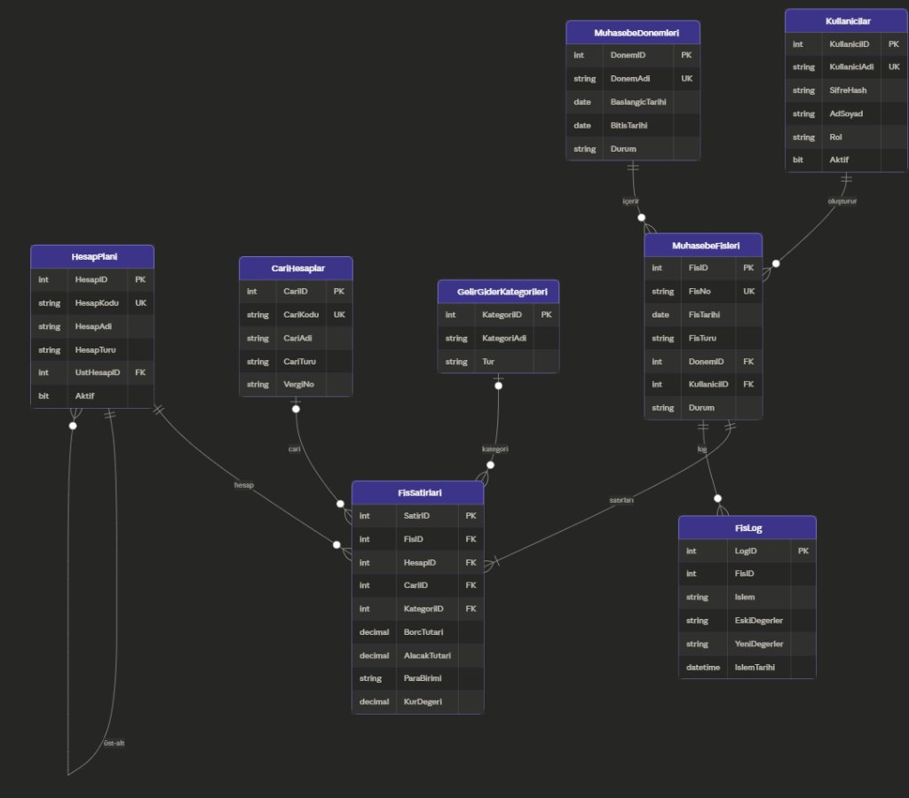

# Muhasebe Veritabanı Sistemi

[English](README.md) | **Türkçe**

Küçük ve orta ölçekli işletmeler için muhasebe fişi, gelir-gider ve defter
yönetimi sağlayan ilişkisel veritabanı projesi. SQL Server (T-SQL) şeması ve
sorgularının yanında, aynı modeli SQLite üzerinde kullanan bir Flask web
arayüzü içerir.

## Öne Çıkanlar

- **Çift taraflı kayıt (double-entry)** — her fişte toplam borç = toplam alacak
- 3NF'e normalize edilmiş 8 tablolu şema; kendine referanslı hesap planı hiyerarşisi
- Dönem kontrolü (kapalı döneme fiş girilemez) ve yumuşak silme
- **Veritabanı objeleri:** `sp_FisEkle` (transaction kontrollü), `fn_HesapBakiyesi`,
  `vw_GunlukGelirGiderOzeti`, denetim izi için `trg_FisLog_*` trigger'ları
- Rol bazlı yetkilendirme ve parametrik sorgularla SQL Injection önlemi
- 6000 fişlik test verisi

## İçerik

```
sql/
  01_DDL_Create_Tables.sql       Tablolar ve kısıtlar
  02_DML_Insert_Data.sql         Örnek veriler
  03_Temel_Sorgular.sql          Temel sorgular
  04_Ileri_Duzey_Sorgular.sql    JOIN, alt sorgu, analitik sorgular
  05_Veritabani_Objeleri.sql     View, stored procedure, trigger, fonksiyon
  06_Toplu_Fis_Verisi_6000.sql   Toplu test verisi
docs/
  MuhasebeDB_Proje_Dokumani.md   Proje raporu (problem tanımı, ER, normalizasyon, güvenlik)
  ER_Diyagrami.png
webapp/                          Flask web uygulaması (SQLite)
```

## SQL Server Kurulumu

`sql/` klasöründeki scriptleri SSMS veya Azure Data Studio üzerinde numara
sırasıyla çalıştırın.

## Web Uygulaması

Gösterge paneli, fiş listeleme / ekleme / detay, kullanıcı yönetimi ve JSON API
uç noktaları içerir.

```bash
cd webapp
pip install -r requirements.txt
python app.py
```

Uygulama `http://127.0.0.1:5000` adresinde açılır. Veritabanı ilk çalıştırmada
örnek verilerle otomatik oluşturulur. Varsayılan giriş: `admin` / `admin` — ilk
girişten sonra değiştirin.

Daha fazla test verisi için: `python generate_6000_fis.py`


